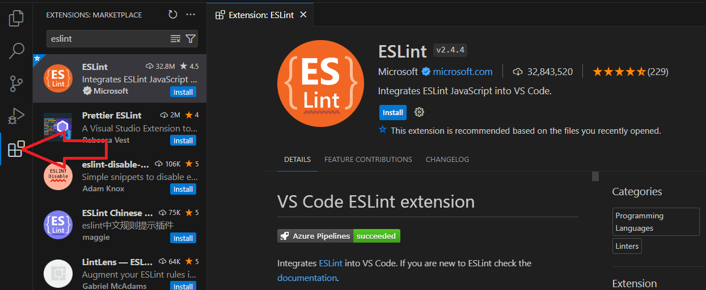

<hr>
<a name="top"></a>

[⬅️](../../README.md#head1234)

# LINTER

Los linters se encargan de examinar el código del programador y lo ayudan cuando detectan errores de sintaxis, código incorrecto, malas prácticas o incluso ayudarlo a seguir unas normas de estilo.

Hay que tener claro que un linter no sólo busca errores que hacen que nuestro código no funcione, sino que también nos ayuda a corregir malos hábitos que desembocan en problemas. Un programa puede ser válido y funcionar, pero aún así, ESLint puede encontrar errores en él.

<p align="center">
  
</p>

## ¿Qué es ESLint?

[ESLint](https://eslint.org) es un linter para código Javascript. Ayuda a detectar que se cumplan unas ciertas normas y criterios (personalizables por el programador) para que el código Javascript escrito siga unos estándares y estilos de calidad, favoreciendo la escritura de código correcto, coherente y consistente. Aunque existen otros linters Javascript (JSHint, JSLint, etc...), ESLint se ha establecido como herramienta estándar de facto.

ESLint es totalmente configurable y puedes indicarle que criterios (llamados reglas) quieres que utilice y cuales prefieres que ignore, adaptándose a las necesidades de cualquier empresa, programador o equipo de trabajo.

```
$ npm init @eslint/config
```

## Configuración inicial de ESLint

Al arrancarse el asistente para configurar ESLint en nuestro proyecto, nos preguntará algunas cuestiones sobre el proyecto a revisar.

### Modo de ESLint

```
? How would you like to use ESLint?
  To check syntax only
  To check syntax and find problems
> To check syntax, find problems, and enforce code style
```

### Módulos Javascript

```
? What type of modules does your project use?
> JavaScript modules (import/export)
  CommonJS (require/exports)
  None of these
```

### Framework Javascript

```
? Which framework does your project use?
  React
  Vue.js
> None of these
```

### Soporte de TypeScript

```
? Does your project use TypeScript?
> No
  Yes
```

### ¿Javascript cliente o servidor?

Ojo con esta opción. Las opciones no son exclusivas, sino que podemos marcar una o varias (utilizando ).

```
? Where does your code run?
> Browser
> Node
```

### Guía de estilo Javascript

```
? How would you like to define a style for your project?
> Use a popular style guide
  Answer questions about your style
  Inspect your JavaScript file(s)
```

Además de estos paquetes del asistente, existen muchos otros como eslint-config-react-app, eslint-config-prettier, eslint-config-eslint, eslint-config-jest-enzyme (u otros) que puedes buscar en NPM con un simple npm search eslint-config e instalar con un npm install seguido del nombre del paquete.

### Formato de configuración

```
? What format do you want your config file to be in?
> Javascript
  YAML
  JSON
```

### Instalación de paquetes NPM

```
? Would you like to install them now with npm?
  No
> Yes
```

### Cuestiones sobre nuestro estilo

```
? Answer questions about style
> What style of indentation do you use?
> What quotes do you use for strings?
> What line endings do you use?
> Do you require semicolons?
```

### El fichero .eslintrc.cjs

```cjs
module.exports = {
  root: true,
  env: {
    browser: true /* El objetivo del código es ejecutar en navegadores*/,
    es2020: true /* El código estará escrito en ECMAScript 2020*/,
  },
  extends: [
    "eslint:recommended" /* Reglas marcadas con ✓ en eslint.org/docs/rules/ */,
    "plugin:react/recommended" /* Reglas del paquete eslint-config-standard */,
    "plugin:react/jsx-runtime",
    "plugin:react-hooks/recommended",
  ],
  ignorePatterns: ["dist", ".eslintrc.cjs"],
  parserOptions: {
    ecmaVersion: "latest" /* Establece la versión de ECMAScript que se usará */,
    sourceType: "module" /* Indica si se usan módulos ESM o solo scripts */,
  },
  settings: { react: { version: "18.2" } },
  plugins: ["react-refresh"],
  rules: {
    "react/jsx-no-target-blank": "off",
    "react-refresh/only-export-components": [
      "warn",
      { allowConstantExport: true },
      "no-console": "off",
    ],
  },
};
```

### Autofix con ESLint

ESLint se encargue de corregir los errores automáticamente, sin que tengamos que hacerlo nosotros manualmente, simplemente siguiento las reglas preconfiguradas.

```
$ npx eslint --fix src/js/index.js

```

### .esLintignore

La sintaxis de .eslintignore es similar a la de .gitignore. Para ignorar un archivo myfile.js, todo lo que necesita hacer es agregar la siguiente línea a .eslintignore:

```js
myfile.js;
```

### Plugins de ESLint

Ten en cuenta que en esta guía hemos visto como configurar [ESLint](https://marketplace.visualstudio.com/items?itemName=dbaeumer.vscode-eslint) como herramienta de terminal. Sin embargo, podría ser mucho más cómodo (e incluso común) configurarlo en el editor de código que utilicemos, para que nos muestre las recomendaciones y errores a medida que vamos escribiendo nuestro programa, sin necesidad de estar mirando la terminal, o ejecutando los comandos.

<p align="center">
  
</p>
<hr>

### Edicion de reglas

```js
/* eslint no-console: "error" */

console.log("Log a debug level message.");
```

[⬆️](#top)

<hr>
