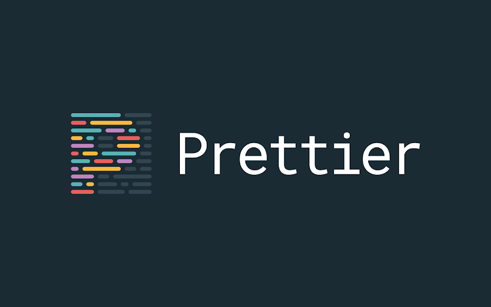
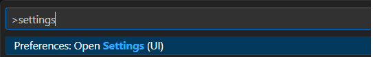
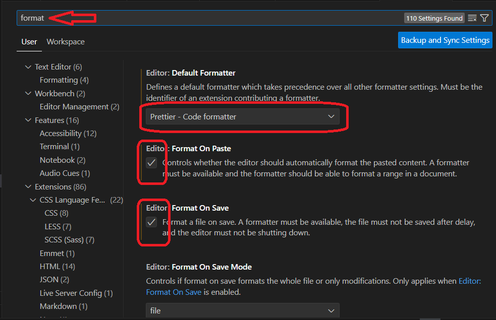

<hr>

<a name="top"></a>

[⬅️](../../README.md#head1234)

<p align="center">
  
</p>
<hr>

[Prettier](https://prettier.io) es un formateador automático de código.

```
npm install --save-dev --save-exact prettier
npm install -D prettier
```

## Formatear codigo

```
npx prettier . --write
npx prettier src/* --write
```

### .prettierrc.json

```json
{
  "trailingComma": "es5",
  "tabWidth": 4,
  "semi": true,
  "doubleQuote": true
}
```

#### Vincular con eslint

```
npm install -D stylelint-config-prettier
```

### .eslintrc.cjs

```json
{
  "extends": [
    // other configs ...
    "stylelint-config-prettier"
  ]
}
```

### .prettierignore

```git
# Ignore artifacts:
build
coverage

# Ignore all HTML files:
**/*.html
```

<hr>

### Configuracion con VSC

- ctrl + shift + p

<p align="center">
  
</p>
- teclear "format"
<p align="center">
  
</p>

[⬆️](#top)

<hr>
